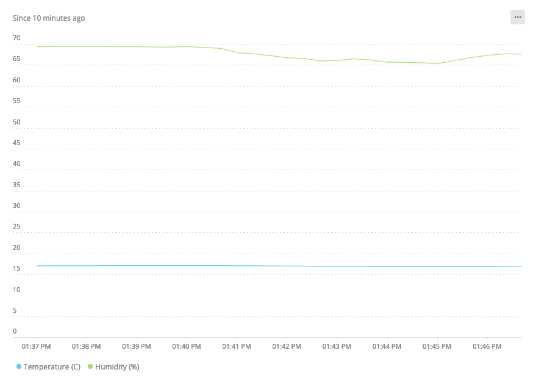

# IoT Relic

IoT Relic is a project created during a 48h hackathon organized by New Relic in January 2022.

## Introduction

In this project I implemented an UDP collector that ingests metrics, and a library for Arduino with the client for that collector. Also, as a PoC, there is a simple Arduino application that reads data from sensors (temperature, humidity, etc), generates metrics and sends them to the collector.

Why an UDP collector? Because the main target is IoT devices. In IoT you usually have microcontrollers with small resources (CPU and Memory) and also slow connections like LoRaWAN, BLE or ZigBee, designed for low power, not for speed. Even if using a faster network, like WiFi, sending small chunks of data is important to save battery. In this environment, using HTTPS, or even TCP, has an unacceptable cost. A simple lightweight protocol based on UDP, without control flow, without buffering, without encryption, is probably the best option when you want to send millions of metrics from thousands of microcontrollers and sensors in a decentralized manner using low bitrate connections.

There are other protocols designed for IoT devices, of which the most prominent are [MQTT](https://en.wikipedia.org/wiki/MQTT) and [CoAP](https://en.wikipedia.org/wiki/Constrained_Application_Protocol). But in this project I decided to create a custom protocol, instead of using one of the existing, for the following reasons:

- MQTT is powerful, but too complex for many scenarios, even if the protocol is often described as "lightweight".
- CoAP is simple enough and very flexible, but is a general purpose protocol designed for bidirectional comunications, where a telemetry protocol only needs unidirectional transmissions.

Some other protocols claim to be well suited for IoT, like InfluxDB's [Line Protocol](https://docs.influxdata.com/influxdb/v2.1/reference/syntax/line-protocol/). It is an HTTP(S)-based text protocol, and thus it's probably too complex and heavy for most IoT applications using microcontrollers.

## The NRLTP

The NRLTP (New Relic Lightweight Telemetry Protocol) is designed to meet the following requirements:

1. Specialized. Designed to do one job (telemetry), the implementation must fit in a microcontroller with slow CPU and small memory, and still leave room enough for the application code.
2. Flexible. It supports future extensions keeping older implementations compatible.
3. Simple. It's easy to understand and reimplement.

Click [here](NRLTP.md) to read the protocol description.

## Components

The project is divided into two parts: the microcontroller firmware and the collector. The former is written in C++ and is located at `src/arduino/sensor_nr_agent`. The latter is made in Rust and located at `src/nrltp-collector`.

Both offer reusable component that can be integrated in other projects seamlessly. For the microcontroller there is a NRLTP client library, located at `src/arduino/sensor_nr_agent/NRLTPClient.cpp`. For the collector, a NRLTP server library located at `src/nrltp-collector/nrltp_server`.

## Getting Started

To build and test the Arduino part, first you need an [Arduino MKR1000](https://store-usa.arduino.cc/products/arduino-mkr1000-wifi) (or any other Arduito compatible with the WiFi101 library) and a [Grove sensor](https://store.arduino.cc/products/grove-temperature-humidity-sensor). To setup the Arduino device and IDE, have a look at the quickstart guide found [here](https://docs.arduino.cc/hardware/mkr-1000-wifi). Then do the following:

1. Open the Arduino IDE and load the sketch inside `src/arduino/sensor_nr_agent`.
2. Edit file `src/arduino/sensor_nr_agent/credentials.h` and configure your WiFi credentials and collector address.
3. Install the networking lib: go to `Tools > Manage libraries`, find `WiFi101` and install it.
4. Install the sensor lib: open this [link](https://github.com/Seeed-Studio/Grove_Temper_Humidity) and follow the instructions.
5. Make sure the Arduino board is connected and select the board in the Arduino IDE. Finally run the sketch by clicking `Upload`.

For the collector part, first install [Rust](https://www.rust-lang.org/tools/install), then:

1. Open a terminal and go to `src/nrltp-collector`.
2. Run `cargo run -- -l "API-KEY"` using your New Relic License Key as `API-KEY`.

## Data

The demo app provided in this repo generates two types of metrics:

1. Temperature in celsius * 100, with matric name = `Temp` and type `gauge`.
2. Humidity in percentage * 100, with matric name = `Humi` and type `gauge`.

We use x100 metric values to avoid using float numbers. Instead we use a fixed point representation with integers.

Both metrics include an attribute called `clientId` containing a string that identifies the arduino that sent the metric, in this case, `ARDUI_01`.

They can be visualized using the following NRQL:

```sql
SELECT average(Temp / 100.0) as 'Temperature (C)', average(Humi) / 100.0 as 'Humidity (%)' FROM Metric TIMESERIES SINCE 10 minutes ago
```



## License

IoT-Relic is licensed under the [Apache 2.0](http://apache.org/licenses/LICENSE-2.0.txt) License.
